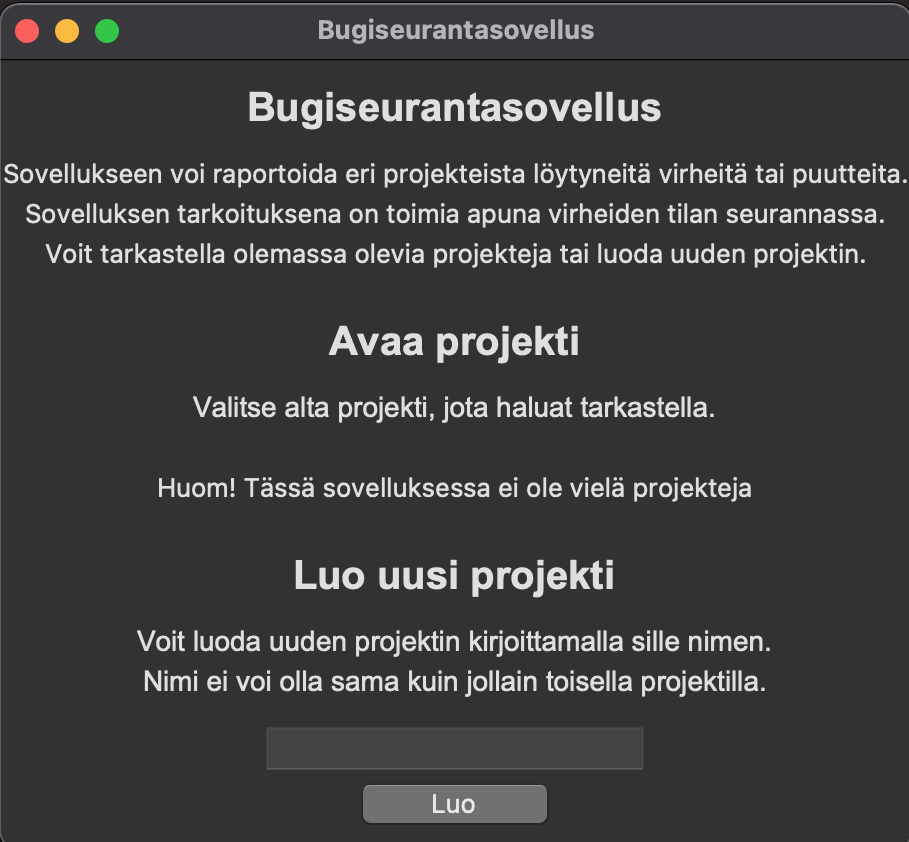
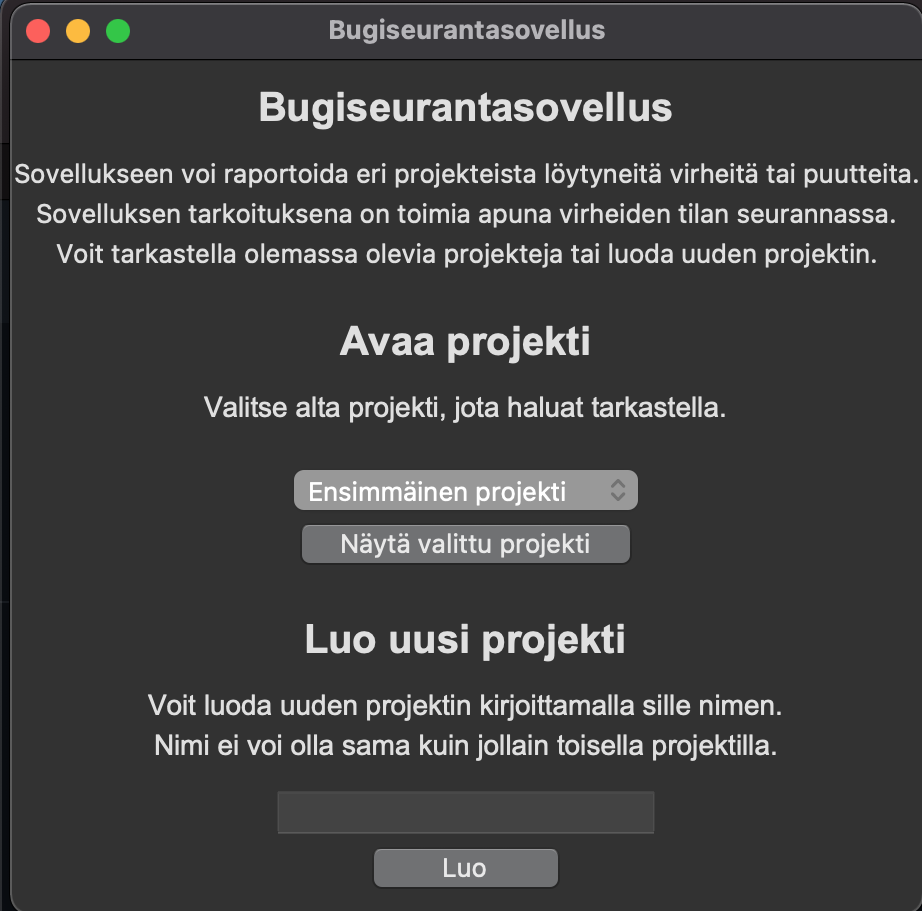
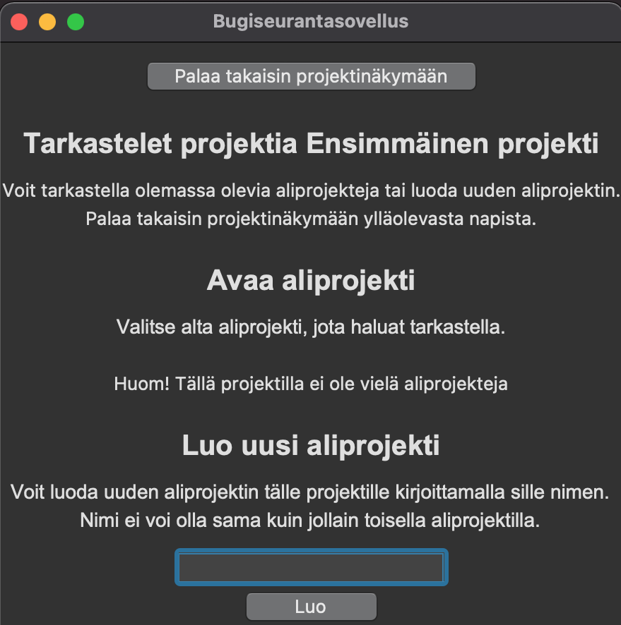
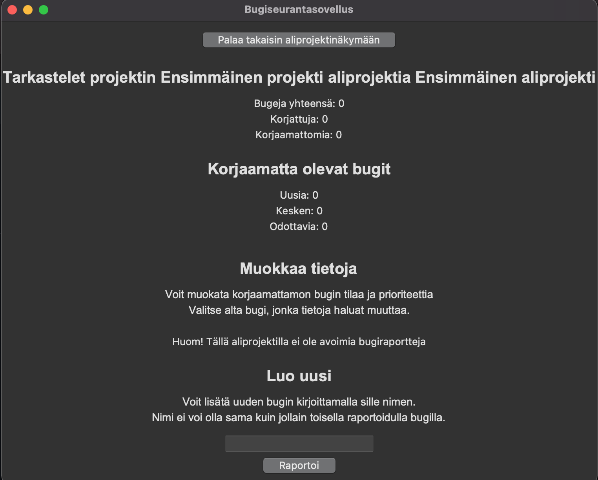

# Käyttöohje

Lataa projektin viimeisin releasen lähdekoodi valitsemmalla sivupalkista relase *Loppupalautus*

## Konfigurointi 

Sovelluksen tiedot tallennetaan SQLite-tietokantaan. Tallennukseen käytettävien tiedostojen nimiä voi konfiguroida .env-tiedostossa. Nämä tiedostot tulee olla *data*-hakemiston alla.

    DATABASE_FILENAME=database.sqlite

Testaukseen käytettävän tiedoston nimen voi konfiguroida .env.test-tiedostossa. 

    DATABASE_FILENAME=test-database.sqlite

## Ohjelman käynnistäminen ensimmäistä kertaa

Alusta projekti ja asenna riippuvuudet komennolla:

    poetry install

Siirry suorittamaan koodi virtuaaliympäristössä:

    poetry shell

Alusta tietokanta komennolla:

    python3 src/initialize_database.py

Ohjelman suoritus onnistuu komennolla:

    poetry run invoke start

## Ohjelman käyttäminen ja käyttäminen

Kun käynnistät ohjelman, sinulle avautuu projektinäkymä. Jos kokeilet ohjelmaa ensimmäistä kertaa, sinulle ei vielä näy projekteja. Voit luoda uuden projektin kirjoittamalla sille ensin nimen ja painamalla sitten "Luo".

Kun olet luonut uuden projektin onnistuneesti, avautuu projektinäkymään nyt dropdown-valikko, josta voit valita luomasi projektin tarkasteltavaksi. Painamalla "Näytä valittu projekti" aukeaa aliprojektinäkymä. 

Tämä näkymä toimii tasan samalla tavalla kuin projektinäkymä. Ensimmäistä kertaa sinun tulee luoda uusi aliprojekti projektillesi, minkä jälkeen voit avata luomasi aliprojektin ja tarkastella sen tietoja. Aliprojektista pääset takaisin projektinäkymään valitsemalla "Palaa takaisin projektinäkymään".

Kun olet luonut uuden aliprojektin, voit siirtyä tarkastelemaan sen tietoja hakemalla sen dropdown-valikosta ja painamalla "Näytä valittu aliprojekti". Nyt eteesi avautuu virhehavaintonäkymä. Tässä näkymässä näät tilastoja virhehavainnoista, voit muokata niiden tietoja sekä voit raportoida uusista virhehavainnoista. Luo uusi virhehavainto kohdasta *Luo uusi*, kirjoita sille kuvaava nimi ja paina "Raportoi". Jokainen uusi bugi saa automaattisesti statuksen *Uusi* ja prioriteetin *Vähäinen*.

Kun sinulla on aliprojektissa virhehavaintoja, näät niiden tiedot ja voit muokata niitä kohdasta *Muokkaa tietoja*. Valitse ensin dropdown-valikosta minkä bugin tietoja haluat muuttaa. Sen jälkeen voit muuttaa joko tilastatusta (Uusi/Kesken/Odottaa/Korjattu) tai prioriteettia (Vähäinen/Normaali/Korkea). Voit muuttaa kerralla vain toista. Valitse ensin dropdown-valikosta joko uusi status tai uusi prioriteetti ja sen jälkeen paina "Päivitä status" tai "Päivitä prioriteetti" riippuen siitä, kumpaa haluat muuttaa. Huomaa, että jos merkitset virhehavainnon tilasta

